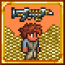

# Stop Coins Combining

Forces coins to no longer combine after a certain tier if you have the Coin Gun (or any other weapon that uses coins as ammo).
By default, Silver Coins and higher won't combine. The tier is configurable. You can also force this behavior even if you don't have the Coin Gun. If you don't want the behavior at all, you can also disable the mod entirely from the config.
Client-side.

[Download the mod on Steam!](https://steamcommunity.com/sharedfiles/filedetails/?id=3112344224)

## Mod Calls

| Call | Description | Example
| --- | --- | --- |
| `"Config", "ModEnabled" : bool` | Returns the value of the "Mod Enabled" config option. | `if ((bool)mod.Call("Config", "ModEnabled"))` |
| `"Config", "HighestCoinTypeToKeep" : int` | Returns the value of the "Highest Coin Type to Keep" config option. 0 is Copper, 1 is Silver, 2 is Gold. | `if ((int)mod.Call("Config", "HighestCoinTypeToKeep") == 1)` |
| `"Config", "OnlyKeepSeparateWhenUsingCoins" : bool` | Returns the value of the "Only Keep Separate When Using Coins" config option. | `if ((bool)mod.Call("Config", "OnlyKeepSeparateWhenUsingCoins"))` |
| `"ShouldKeepCoinsSeparate", Player player : bool` | A shorthand check for if the provided player should combine coins. Takes into account if the mod is enabled and if the player is carrying a coin-using item. | `if ((bool)mod.Call("ShouldKeepCoinsSeparate", player))` |
| `"HasItemThatUsesCoins", Player player : bool` | Determines if the provided player is holding an item that uses coins. | `if ((bool)mod.Call("HasItemThatUsesCoins", player))` |
| `"MarkAsCarryingItemThatUsesCoins", Player player : void` | Marks that the given player is carrying an item that uses coins. Useful for if your mod has an item that uses coins for something other than ammo (i.e. not `Item.useAmmo = AmmoID.Coin;`). `Mod/GlobalItem::UpdateInventory()` is a good place to call this. | `mod.Call("MarkAsCarryingItemThatUsesCoins", player);` |